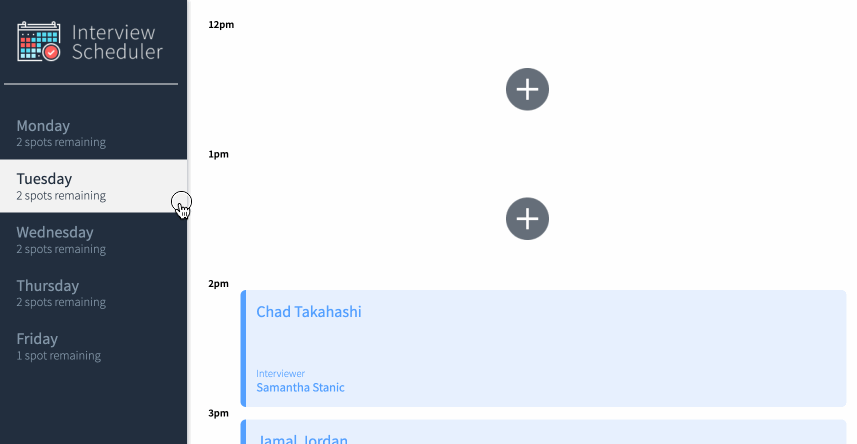

# Interview Scheduler

## About Interview Scheduler

Interview Scheduler is a single-page application (SPA) that allows users to book technical interviews between students and mentors. Appointments can be between the hours of 12 PM and 5 PM, Monday to Friday. Each appointment has one student and one interviewer.

When creating a new appointment, the user can enter any student name while the interviewer is chosen from a predefined list. The user can save the appointment and view the entire schedule of appointments on any day of the week.

Appointments can also be edited or deleted.

The front end of this project is built with React and makes requests to an API to fetch and store appointment data from a database.

## Purpose

This project is part of my learnings at Lighthouse Labs.

## Project Outcomes

- Use React to create a single page application (SPA) called Interview Scheduler.

- Have the client application communicate with an API server over HTTP, using Axios to make calls to the API.

- Gain experience with different development environments, including Storybook, Jest, and Webpack Dev Server.

## Screenshots

This gif shows a new appointment being created, edited and finally deleted in the app.



## Setup

Install dependencies with `npm install`.

## Dependencies

- axios
- classnames
- normalize.css
- react
- react-dom
- react-scripts

## Dev Dependencies
- storybook/addon-actions
- babel/core
- storybook/addon-backgrounds
- storybook/addon-links
- storybook/addons
- storybook/react
- testing-library/jest-dom
- testing-library/react
- testing-library/react-hooks
- babel-loader
- prop-types
- react-test-renderer
- sass

## Running Webpack Development Server

```sh
npm start
```

## Running Jest Test Framework

```sh
npm test
```

## Running Storybook Visual Testbed

```sh
npm run storybook
```

## Running Cypress End-To-End Testing

```sh
npm run cypress
```


## Project Structure
```
├── .storybook
├── cypress
│   ├── downloads
│   ├── fixtures
│   ├── integration
│   ├── plugins
│   └── support
├── public
│   └── images
├── src
│   ├── __mocks__
│   ├── components
│   │   ├── __tests__
│   │   └── Appointment
│   ├── helpers
│   ├── hooks
│   │   └── __tests__
│   ├── reducers
│   └── styles
└── stories
```


