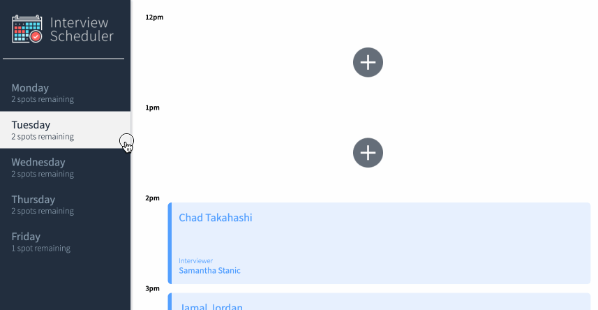

# Interview Scheduler

## About Interview Scheduler

Interview Scheduler is a single-page application (SPA) that allows users to book technical interviews between students and mentors. Appointments can be between the hours of 12 PM and 5 PM, Monday to Friday. Each appointment has one student and one interviewer.

When creating a new appointment, the user can enter any student name while the interviewer is chosen from a predefined list. The user can save the appointment and view the entire schedule of appointments on any day of the week.

Appointments can also be edited or deleted.

The front end of this project is built with React and makes requests to an API to fetch and store appointment data from a database.

## Purpose

This project is part of my learnings at Lighthouse Labs.

## Project Outcomes

- Use React to create a single page application (SPA) called Interview Scheduler.

- Have the client application communicate with an API server over HTTP, using Axios to make calls to the API.

- Gain experience with different development environments, including Storybook, Jest, and Webpack Dev Server.

## Stretch Features

- `useReducer`: The custom useApplicationData Hook has been refactored using useReducer.

- `Spots remaining`: The spots remaining functionality has been implemented with reducers.

- `WebSocket server connection`: The WebSocket API has been used to make persistent connections to the scheduler API server.

## Screenshots

This gif shows a new appointment being created, edited and then cancelled in the app:



## Setup

Install dependencies with `npm install`.

## Dependencies

- axios
- classnames
- normalize.css
- react
- react-dom
- react-scripts

## Dev Dependencies
- storybook/addon-actions
- babel/core
- storybook/addon-backgrounds
- storybook/addon-links
- storybook/addons
- storybook/react
- testing-library/jest-dom
- testing-library/react
- testing-library/react-hooks
- babel-loader
- prop-types
- react-test-renderer
- sass

## Running the Scheduler-Api Server

In order for the Scheduler App to run, you will also need to install and run the Scheduler-Api server.  Instruction can be found in the README.md file of the Scheduler-Api GitHub repoistory below:

[scheduler-api server](https://github.com/lighthouse-labs/scheduler-api)

Note that the API server needs to run as a separate process in another terminal.

## Running Webpack Development Server

```sh
npm start
```

## Running Jest Test Framework

```sh
npm test
```

## Running Storybook Visual Testbed

```sh
npm run storybook
```

## Running Cypress End-To-End Testing

```sh
npm run cypress
```

## Project Directory Structure
```
├── .storybook
├── cypress
│   ├── downloads
│   ├── fixtures
│   ├── integration
│   ├── plugins
│   └── support
├── public
│   └── images
├── src
│   ├── __mocks__
│   ├── components
│   │   ├── __tests__
│   │   └── Appointment
│   ├── helpers
│   ├── hooks
│   │   └── __tests__
│   ├── reducers
│   └── styles
└── stories
```

## Documentation

I have developed the following files within the app:

### cypress > integration

`appointments.spec.js`: End-to-end testing to add, edit and cancel appointments.

`navigation.spec.js`: End-to-end testing to change the selected day.

### src > \_\_mocks\_\_

`axios.js`: static data to replace API fetching when testing with Jest.

### src > components > \_\_tests\_\_

`Application.test.js`: Jest integration testing for Application behaviour.

`Appointment.test.js`: Jest unit test that the componant is rendered.  Skipped by default.

`Button.test.js`: Jest unit tests for the Button component.

`DayListItem.test.js`: Jest unit test for the number of spots remaining displayed by the DayListItem component. 

`Form.test.js`: Jest unit tests on the Form component.

### src components > Appointment & Components

This section of files with Capialized names contains the components (.js) and their styles (.scss).

### src > helpers

`selectors.js`: Transform api data into a format optimized for the data structure of the app.

`selectors.test.js`: Jest unit tests for the selector functions.

### src > hooks > \_\_tests\_\_

`useVisualMode.test.js`: Jest unit tests for the corresponding custom hooks.

### src > hooks

`useApplicationData.test.js`: Custom hooks to modify appointments, contains WebSocket server connection.

`useVisualMode.test.js`: A custom hook that uses a data stack to manage form views for the appointments.

### reducers

`application.js`: Contains the reducer function and an associated function to update the spots remaining.

`application.test.js`: Single Jest unit test for error handling in the reducer function.

### stories

`index.js`: Storybook unit tests for the individual components.


